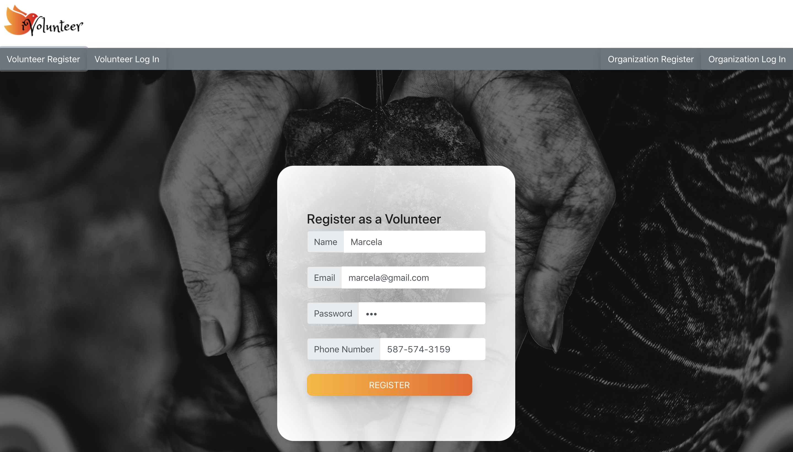
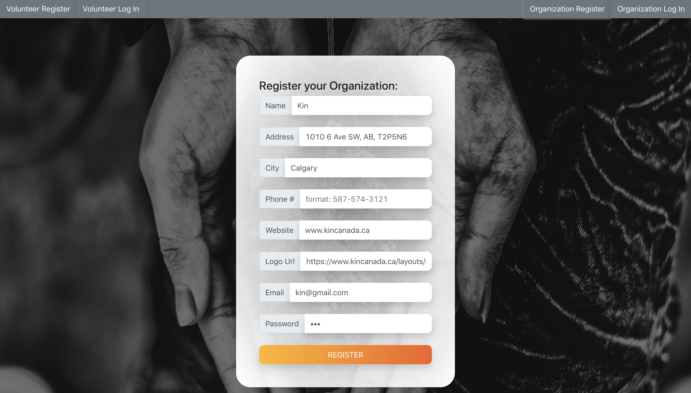

## iVolunteer
A website to find volunteering opportunities.

## Motivation
As a person that loves to volunteer, sometimes finding volunteering opportunities last minute its hard. 
This website was designed having in mind that sometimes people have suddently a weekend off and would like to volunteer. This website allows you to sign up whenever you are free, without having to contact the non-profit organization and waiting for a response. 

#
 
## Screenshots

<b>Built with</b>
- React

## Installation steps: 
- clone repository 
- npm install
- npm start 
Note: if you are using windows go to "package.json" and run change "start": "PORT=8080 react-scripts start" =======> TO =========>  "start": "set PORT=8080 && react-scripts start" )

